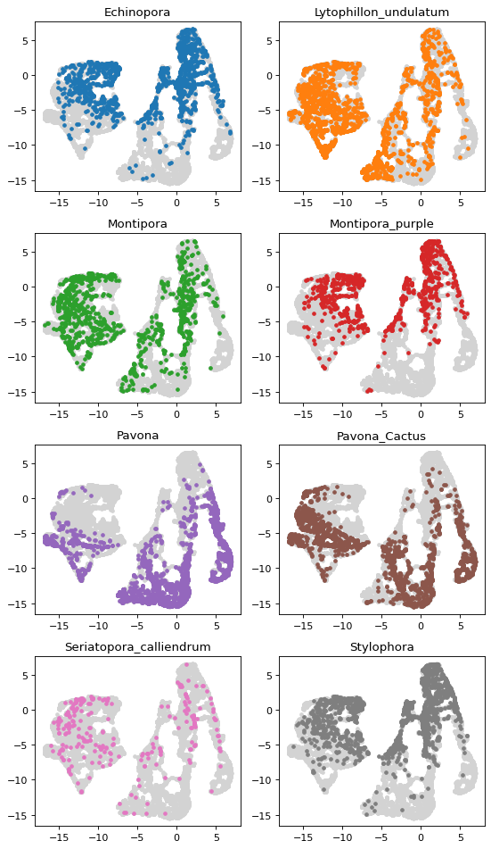
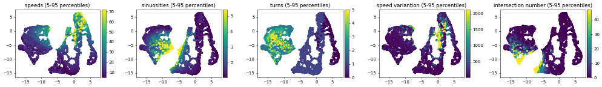

# Load modules and data


```python
import matplotlib
import matplotlib.image as mpimg 
import matplotlib.pyplot as plt
import seaborn as sns
import pandas as pd
import numpy as np
from functools import partial
import glob
import sys
import logging
import multiprocessing
from p_tqdm import p_map
from itertools import compress
from os import path as ospath
import scipy.sparse

import os
os.environ['NUMEXPR_MAX_THREADS'] = '42'
os.environ['NUMEXPR_NUM_THREADS'] = '21'


logging.basicConfig(format='%(asctime)s - %(message)s', level=logging.INFO)

from helpers import track_tools

```

## Vectorize information about file location for better efficiency


```python
species=list(map(lambda x: x.split("/")[1],glob.glob("Track_Data/*/")))
vectorized=list()
for spe in species:
    path = 'Track_Data/'+spe
    files = [f for f in glob.glob(path + "/**/all_tracks.csv", recursive=True)]
    for i in range(len(files)):
        vectorized.append([spe,i])
```


```python
len(vectorized)
```


    35


## functions that will load the data 


```python
from helpers import line_intersection3
from itertools import groupby

numcores=21


#specie=["Echinopora"]

def gather_dat(vector):
    spe=vector[0]
    rep=vector[1]
    path = 'Track_Data/'+spe
    scale=pd.read_table('Track_Data/'+spe+'/scale',header=0)
    sc=scale["real_distance"][0]/scale["imaris_distance"][0]
    fl=next(os.walk(path))[1]
    fl=list(compress(fl, list(map(lambda x: x!=".ipynb_checkpoints",fl))))
    files = [f for f in glob.glob(path + "/**/all_tracks.csv", recursive=True)]
    adata=pd.concat(list(map(pd.read_csv,files)),keys=list(range(0,len(files))))

    allparents=np.unique(adata.loc[rep]["Parent"])
    allparents=allparents[~np.isnan(allparents)]

    ldata=list(map(lambda x: adata.loc[rep][["Position X","Position Y","Time"]].loc[adata.loc[rep].index[adata.loc[rep]["Parent"].isin([x],)]], 
                         [par for par in allparents]))
    ldata=list(map(track_tools.distances_accelerations,ldata))
    results = list(map(track_tools.sinuosities_max, ldata))
    turns=list(map(lambda y: sum([x[0] for x in groupby(y["sinuosity"]>1.1)]), results))
    sin=list(map(track_tools.sinuosities_track, ldata))
    length=list(map(lambda x: np.nansum(x["dst"]),ldata))
    npoints=list(map(lambda x: len(x["dst"]),ldata))
    speedvar=list(map(lambda x: np.nanvar(x["acc"]),ldata))
    speedmean=list(map(lambda x: np.nanmean(x["dst"]),ldata))

    lseg=list(map(lambda x: np.hstack([x.values[:-1,:2],x.values[1:,:2]]).tolist(),ldata))
    inter=list(map(lambda x: len(list(line_intersection3.line_intersections(x))),lseg))

    A=[turns,sin,length,npoints,speedmean,speedvar,inter]
    dat=pd.DataFrame(A).T
    dat.columns=["turns","sin","length","npoints","speedmean","speedvar","inter"]
    dat["rep"]=rep
    dat["specie"]=spe
        
    return(dat)


def gather_ldat(vector):
    spe=vector[0]
    rep=vector[1]
    path = 'Track_Data/'+spe
    scale=pd.read_table('Track_Data/'+spe+'/scale',header=0)
    sc=scale["real_distance"][0]/scale["imaris_distance"][0]
    fl=next(os.walk(path))[1]
    fl=list(compress(fl, list(map(lambda x: x!=".ipynb_checkpoints",fl))))
    files = [f for f in glob.glob(path + "/**/all_tracks.csv", recursive=True)]
    adata=pd.concat(list(map(pd.read_csv,files)),keys=list(range(0,len(files))))

    allparents=np.unique(adata.loc[rep]["Parent"])
    allparents=allparents[~np.isnan(allparents)]

    ldata=list(map(lambda x: adata.loc[rep][["Position X","Position Y","Time"]].loc[adata.loc[rep].index[adata.loc[rep]["Parent"].isin([x],)]], 
                         [par for par in allparents]))
        
    return(ldata)
```

## Getting the data


```python
alldat=p_map(gather_dat,vectorized)
```


    HBox(children=(FloatProgress(value=0.0, max=35.0), HTML(value='')))


    


```python
all_ldata=p_map(gather_ldat,vectorized)
```


    HBox(children=(FloatProgress(value=0.0, max=35.0), HTML(value='')))


    


```python
alldat=pd.concat(alldat)
```


```python
alldat.shape
```


    (10963, 9)


# UMAP Analysis

## Extracting features


```python
species=alldat["specie"]
features=["turns","sin","speedmean","speedvar","inter"]
from sklearn.preprocessing import StandardScaler
x = alldat.loc[:, features].values
```

## Remove NAN entries and standardize the data


```python
idx_torem=(np.argwhere(np.apply_along_axis(lambda y: any(np.isnan(y)),1,x))).flatten().tolist()
alldat=alldat.reset_index()
alldat=alldat.drop(idx_torem)
species=np.delete(species.values,idx_torem)
x=np.delete(x,idx_torem,axis=0)
x = StandardScaler().fit_transform(x)
```

## Run UMAP


```python
import umap
reducer = umap.UMAP(random_state=42,metric="correlation")
embedding = reducer.fit_transform(x)
emb=pd.DataFrame(embedding)
```


```python
emb["specie"]=species
emb=emb.rename(columns={0: "UMAP1",1:"UMAP2"})
emb.loc[:,"UMAP2"]=-emb.loc[:,"UMAP2"]
emb.loc[:,"UMAP1"]=-emb.loc[:,"UMAP1"]
```


```python
groups = emb.groupby('specie')
fig, ax = plt.subplots(figsize=(8,8),dpi=80)
ax.set_aspect('equal')
ax.margins(0.05) # Optional, just adds 5% padding to the autoscaling
for name, group in groups:
    ax.scatter(group.UMAP1, group.UMAP2, marker='o', label=name,s=10)
ax.legend(loc='center left', bbox_to_anchor=(1, 0.5))
fig.tight_layout()
plt.axis('off')
#plt.savefig("UMAP_species.svg")
```


    (-18.06170260906219,
     8.145791411399838,
     -16.596912837028505,
     7.6995754003524794)


## Plot species distribution on UMAP


```python
fig, ax = plt.subplots(figsize=(7,12),dpi=80)
k=1
for name, group in groups:
    plt.subplot(4,2,k)
    plt.scatter(emb.UMAP1, emb.UMAP2, marker='o', c="lightgrey",label=name,s=10)
    plt.scatter(group.UMAP1, group.UMAP2, marker='o',c="C"+str(k-1),s=10)
    plt.title(name)
    k=k+1
plt.tight_layout()

#plt.savefig("UMAP_species_separate.svg")
```





## Plot features on UMAP


```python
def format_percentile(val,p=5):
    perc=np.percentile(val,[p,100-p])
    val[val<perc[0]]=perc[0]
    val[val>perc[1]]=perc[1]
    return(val)
```


```python
from mpl_toolkits.axes_grid1 import make_axes_locatable
plt.figure(figsize=(20,3),dpi=50)
ax = plt.subplot(1,5,1)
pl=ax.scatter(emb.UMAP1,emb.UMAP2,c=format_percentile(alldat.speedmean),cmap="viridis", marker='o',s=10)
plt.title("speeds (5-95 percentiles)")
divider = make_axes_locatable(ax)
cax = divider.append_axes("right", size="5%", pad=0.05)
plt.colorbar(pl, cax=cax)

ax = plt.subplot(1,5,2)
pl=ax.scatter(emb.UMAP1,emb.UMAP2,c=format_percentile(alldat.sin),cmap="viridis", marker='o',s=10)
plt.title("sinuosities (5-95 percentiles)")
divider = make_axes_locatable(ax)
cax = divider.append_axes("right", size="5%", pad=0.05)
plt.colorbar(pl, cax=cax)

ax=plt.subplot(1,5,3)
pl=ax.scatter(emb.UMAP1,emb.UMAP2,c=format_percentile(alldat.turns),cmap="viridis", marker='o',s=10)
plt.title("turns (5-95 percentiles)")
divider = make_axes_locatable(ax)
cax = divider.append_axes("right", size="5%", pad=0.05)
plt.colorbar(pl, cax=cax)

ax=plt.subplot(1,5,4)
pl=ax.scatter(emb.UMAP1,emb.UMAP2,c=format_percentile(alldat.speedvar),cmap="viridis", marker='o',s=10)
plt.title("speed variantion (5-95 percentiles)")
divider = make_axes_locatable(ax)
cax = divider.append_axes("right", size="5%", pad=0.05)
plt.colorbar(pl, cax=cax)


ax=plt.subplot(1,5,5)
pl=ax.scatter(emb.UMAP1,emb.UMAP2,c=format_percentile(alldat.inter),cmap="viridis", marker='o',s=10)
plt.title("intersection number (5-95 percentiles)")
divider = make_axes_locatable(ax)
cax = divider.append_axes("right", size="5%", pad=0.05)
plt.colorbar(pl, cax=cax)

plt.tight_layout()
#plt.savefig("UMAP_features.svg")
```

    /home/lfaure/miniconda3/lib/python3.7/site-packages/ipykernel_launcher.py:3: SettingWithCopyWarning: 
    A value is trying to be set on a copy of a slice from a DataFrame
    
    See the caveats in the documentation: http://pandas.pydata.org/pandas-docs/stable/indexing.html#indexing-view-versus-copy
      This is separate from the ipykernel package so we can avoid doing imports until
    /home/lfaure/miniconda3/lib/python3.7/site-packages/ipykernel_launcher.py:4: SettingWithCopyWarning: 
    A value is trying to be set on a copy of a slice from a DataFrame
    
    See the caveats in the documentation: http://pandas.pydata.org/pandas-docs/stable/indexing.html#indexing-view-versus-copy
      after removing the cwd from sys.path.





# Gather all tracks for visualisation


```python
all_ldata=[item for sublist in all_ldata for item in sublist]
```


```python
from emb_tools import rasterizelines
res=list(p_map(rasterizelines,all_ldata))
# mat=np.stack(res,axis=0)
# sparse_matrix = scipy.sparse.csc_matrix(mat)
# scipy.sparse.save_npz('mat.npz', sparse_matrix)
```


```python
mat=np.stack(res,axis=0)
sparse_matrix = scipy.sparse.csc_matrix(mat)
scipy.sparse.save_npz('mat.npz', sparse_matrix)
```


```python
sparse_matrix = scipy.sparse.load_npz('mat.npz')
mat=sparse_matrix.todense()
res=np.vsplit(mat,mat.shape[0])
for idx in idx_torem:
    del res[idx]
```


```python
from emb_tools import show_embedding

show_embedding(emb,alldat,res)
```

    /home/lfaure/miniconda3/lib/python3.7/site-packages/bokeh-2.0.0-py3.7.egg/bokeh/models/mappers.py:147: UserWarning: Palette length does not match number of factors. ['Seriatopora_calliendrum', 'Stylophora'] will be assigned to `nan_color` gray
      warnings.warn("Palette length does not match number of factors. %s will be assigned to `nan_color` %s" % (extra_factors, self.nan_color))


<div class="bk-root" id="76ac4249-3adf-430e-a1d3-253fbc4ef316" data-root-id="1004"></div>


